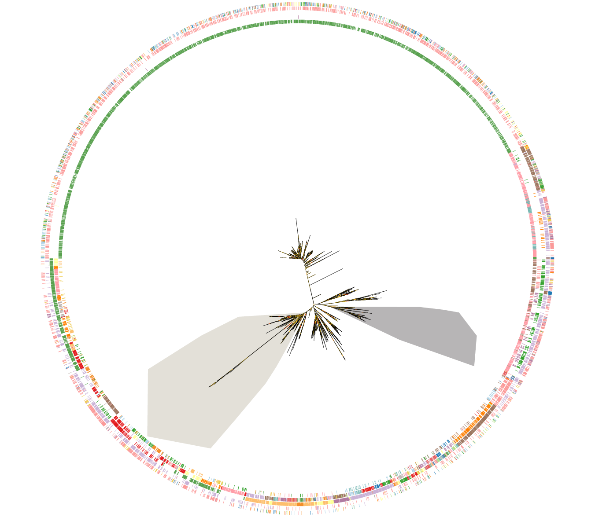

# myTOL: my Tree Of Life

**myTOL** is a fast, browser-based phylogenetic tree viewer. Load a Newick tree, optionally overlay a CSV annotation file, and explore your data interactively, with pan, zoom, colouring, and export built in. All data stays local.

**myTOL** is inspired by iTOL, but is performant with very large trees. I've tested it with 500k leaves, but it should work with more. This is achieved with "Level of Detail" (LOD) thinning - leaves are hidden when they become smaller than a pixel when you zoom out.

I obviously could not have coded this by myself. This was created by passing the code between Gemini and chatGPT until it finally worked (with a LOT of prompting and manual intervention, it must be said). The code was then finalised using Claude Code. Claude then wrote most of this README. I tried to get rid of the AI-ese, but some residue may remain.



---

## Features

- **Three layout modes**: rectangular (phylogram/cladogram), circular, and unrooted equal-angle
- **Annotation tracks**: load a CSV file to display categorical or continuous data bars alongside leaves
- **Coloured ranges**: select any clade and assign it a colour, display as background shading or branch/leaf colouring
- **Support value display**: colour branches by bootstrap/posterior support, optionally show numeric labels
- **Search**: find and jump to any leaf by name
- **Export**: PNG and SVG, the SVG files should hopefully be handled nicely by Illustrator.

---

## Try it with the example data

The `example/` folder contains a ready-to-use tree and annotation file, adapted from [this preprint](https://www.biorxiv.org/content/10.1101/2025.10.16.682844v1) from the Sternberg lab. It's of reverse transcriptases and includes protein length* (continuous data) and RT class (categorical data) 

**Correction, it's just a random integer for demonstration purposes*

| File | Description |
|------|-------------|
| `example/RTtree.nwk` | Example phylogenetic tree in Newick format |
| `example/RTtreelabels.csv` | Annotation table (leaf names in first column) |

Drag and drop `RTtree.nwk` onto the canvas, then drag `RTtreelabels.csv` onto the canvas to add annotations.

---

## Installation

myTOL runs locally in your browser. You only need to do this setup once.

### Step 1: Install Node.js

Node.js is free software that lets you run web apps locally.

- Go to **https://nodejs.org** and download the **LTS** version (the big green button)
- Run the installer and follow the prompts, the defaults are fine
- When it's done, restart your computer if prompted

### Step 2: Download myTOL

**Option A: Download as a ZIP (simplest):**

1. On the GitHub page, click the green **Code** button → **Download ZIP**
2. Unzip the downloaded file somewhere you can find it (e.g. your Desktop or Documents)

**Option B: Clone with Git (if you have Git installed):**

```
git clone https://github.com/YOUR_USERNAME/mytol.git
```

### Step 3: Open a Terminal

- **Mac:** Press `Command + Space`, type `Terminal`, press Enter
- **Windows:** Press the Windows key, type `cmd` or `PowerShell`, press Enter

### Step 4: Navigate to the myTOL folder

In the terminal, type `cd ` (with a space after it), then drag the myTOL folder into the terminal window, it will fill in the path automatically. Press Enter.

Or type the path manually, e.g.:
```
cd Desktop/mytol
```

### Step 5: Install dependencies

Type this and press Enter (only needed once):
```
npm install
```
This downloads the libraries myTOL needs. It may take a minute.

### Step 6: Start the app

```
npm run dev
```

You should see a message like:
```
 VITE v5.x ready in 300ms
 ➜ Local:  http://localhost:5173/
```

Open your browser and go to **http://localhost:5173**: myTOL will be running.

To stop it, go back to the terminal and press `Ctrl + C`.

---

## Usage

### Loading data

- **Drag and drop** a `.nwk` / `.newick` file onto the canvas to load a tree
- **Drag and drop** a `.csv` or `.tsv` file onto the canvas to load annotations
- Or use the **Load** panel on the left

### Annotation CSV format

The first column must be leaf names (matching the tree exactly). Each additional column becomes an annotation track.

```
name,habitat,score
Species_A,forest,0.92
Species_B,grassland,0.45
...
```

### Keyboard shortcuts

| Key | Action |
|-----|--------|
| `+` / `-` | Zoom in / out |
| `F` | Fit tree to window |
| `R` | Reroot at selected node |
| `C` | Add selected clade as a coloured range |
| `Enter` | Confirm colour range |
| `Esc` | Deselect |

### Newick support values

Bootstrap or posterior support values are displayed if internal nodes have numeric names, e.g.:

```
((A:0.1,B:0.2)0.95:0.3,(C:0.1,D:0.2)0.72:0.1)0.88;
```

Enable **Show support values on branches** in the Options panel to display numeric labels.

---

## Browser compatibility

Any modern browser works: Chrome, Firefox, Safari, Edge. A recent version (2022 or newer) is recommended for best canvas performance.

---

## Licence

MIT: free to use, modify, and share.
